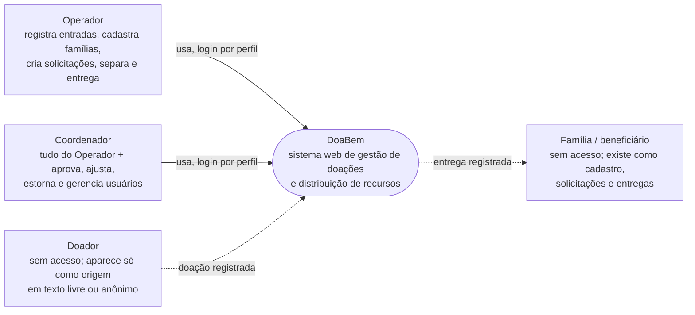
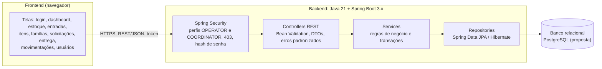
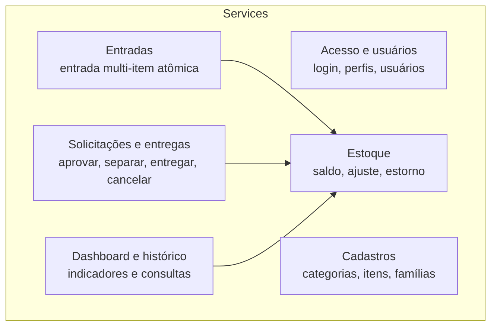
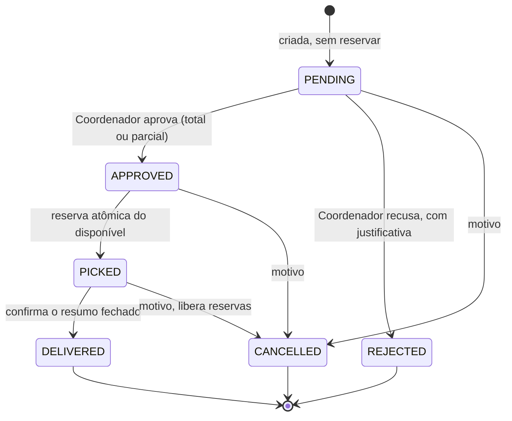
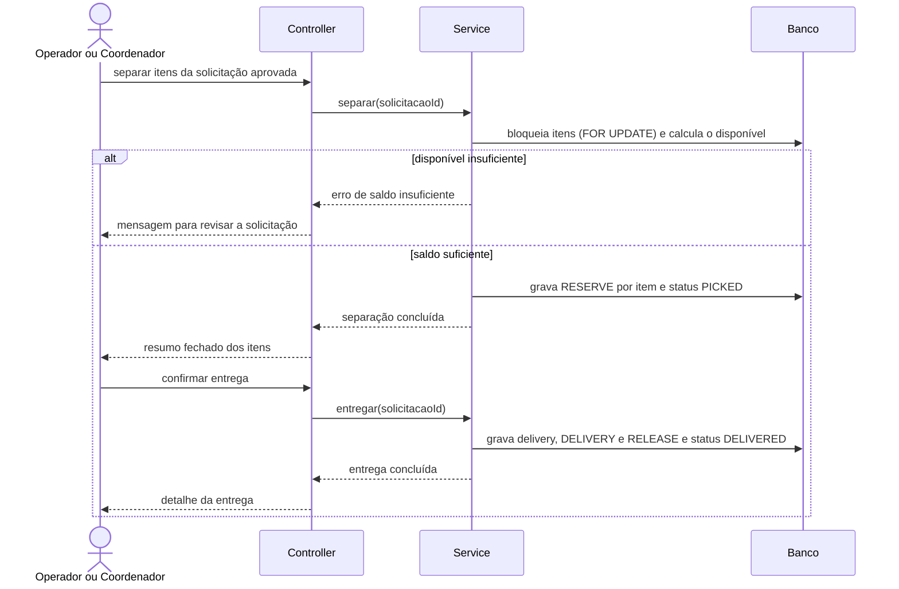

# Arquitetura — DoaBem

> Status: Sprint 01. Itens marcados como **[A CONFIRMAR]** dependem de decisão do grupo. Todos os diagramas estão em Mermaid.

## 1. Contexto do sistema

Sem integrações externas no MVP: não há sistemas governamentais, nota fiscal, logística de coleta nem portal público para doadores.

## 2. Visão geral em camadas

Monólito modular em camadas, sem microsserviços.

### Módulos dentro dos Services

- **Controllers:** recebem a requisição, validam o formato (Jakarta Bean Validation), usam DTOs e chamam o service. Sem regra de negócio.
- **Services:** toda a regra de negócio e as transações (entrada, separação, entrega, cancelamento, estorno).
- **Repositories:** acesso a dados via Spring Data JPA; lock da linha do item nas operações que mexem em saldo.
- **Transversais:** OpenAPI/Swagger para a API, Flyway para migrações e massa de demonstração [A CONFIRMAR], JUnit 5 + Mockito para testes.

## 3. Decisões de stack

| Tema | Obrigatório pelo briefing | Proposta | Justificativa | Status |
|---|---|---|---|---|
| Linguagem | Java 21 | Java 21 | Exigência do briefing | Fechado |
| Framework | Spring Boot 3.x | Spring Boot 3.x | Exigência do briefing | Fechado |
| Build | Livre (Maven ou Gradle) | Maven | Convenção ampla em Spring; `pom.xml` declarativo e fácil de revisar | A CONFIRMAR |
| Banco | PostgreSQL ou MySQL | PostgreSQL | CHECK, transações e bloqueio de linha (`SELECT ... FOR UPDATE`) robustos, úteis para RN01 e RN04 | A CONFIRMAR |
| Frontend | HTML/CSS/JS, framework opcional | A decidir pelo grupo | Depende da familiaridade de quem faz o frontend | A CONFIRMAR |
| Autenticação | Sessão ou token | Token JWT com Spring Security (seção 6) | Desacopla frontend e backend; o PO deixou a escolha com o grupo | A CONFIRMAR |
| Migração de schema | Livre | Flyway | Versiona o schema no Git e cria massa de demonstração reprodutível | A CONFIRMAR |
| Protótipo | Livre | Lovable (protótipo) + Figma (guia de identidade visual) | Capturas versionadas em `docs/mockups` | Em andamento |
| Documentação da API | OpenAPI/Swagger | springdoc-openapi | Gera a documentação a partir do código | Fechado |
| Testes | JUnit 5 (+ Mockito) | JUnit 5 + Mockito (+ Testcontainers, opcional) | Testar regras críticas contra banco real | A CONFIRMAR |

### Opções de frontend (para o grupo decidir)

| Opção | Vantagens | Desvantagens |
|---|---|---|
| HTML/CSS/JS puro | Sem build, curva baixa | Mais código repetido e estado manual |
| React (Vite) | Componentização, ecossistema grande | Exige Node e build |
| Vue | Curva suave | Ecossistema menor |
| Thymeleaf (server-side) | Sem API separada para as telas | Foge do padrão "frontend consome API REST" do briefing |

## 4. Integração entre camadas

1. O frontend chama endpoints HTTP `/api/...` enviando e recebendo JSON.
2. O token de autenticação segue no cabeçalho `Authorization`.
3. O backend valida, aplica regras e persiste via JPA no banco relacional.
4. Erros previsíveis retornam um formato padrão (código HTTP e mensagem), exibido de forma clara no frontend.

## 5. Estoque e integridade

- Saldo físico, reservado e disponível derivam das movimentações válidas; não existe coluna de saldo editável.
- Tipos de movimentação (`stock_movement.type`): ENTRY, RESERVE, RELEASE, DELIVERY, ADJUSTMENT e REVERSAL.
- A aprovação não altera o estoque; a **reserva é feita na separação**, de forma atômica, conferindo o disponível.
- A entrega consome a reserva (DELIVERY e RELEASE) e não admite quantidade parcial; o cancelamento libera as reservas.
- Movimentações concluídas são imutáveis; correção por estorno vinculado ao original, só pelo Coordenador e com justificativa.
- Entrada, separação, entrega e cancelamento são transações únicas (tudo ou nada).
- Proteção contra concorrência: lock da linha do item (`SELECT ... FOR UPDATE`) antes de gravar RESERVE, DELIVERY ou ADJUSTMENT.
- Escala da quantidade: `NUMERIC(12,3)`; itens em UN aceitam apenas inteiros (validado no service e na API).

### Ciclo de vida da solicitação

Valores de `aid_request.status`, em português na interface: PENDING (Pendente), APPROVED (Aprovada), REJECTED (Recusada), PICKED (Separada), DELIVERED (Entregue), CANCELLED (Cancelada).

### Separação e entrega (sequência)

## 6. Autenticação e autorização (proposta, a confirmar)

O PO deixou a escolha entre sessão e token com o grupo, exigindo justificativa de segurança e simplicidade.

| Opção | Vantagens | Desvantagens |
|---|---|---|
| Sessão (cookie) | Simples, revogação imediata, proteção nativa do Spring Security | Exige cookie e CSRF; acopla frontend e backend ao mesmo domínio |
| Token JWT | Frontend e backend desacoplados; fácil de testar a API (Swagger) | Revogação mais difícil; exige expiração curta e cuidado com o armazenamento no cliente |

**Recomendação:** JWT com expiração curta, por manter o frontend desacoplado e simplificar os testes da API. Perfis `OPERATOR` e `COORDINATOR` por `@PreAuthorize`; negar com 403 no backend; usuário inativo não autentica; senhas com BCrypt. Sem fluxo "esqueci minha senha" por e-mail.

## 7. Segurança

- Senhas com hash (BCrypt), nunca em texto puro.
- Rotas protegidas por perfil; ações restritas negadas com 403 no backend, além de ocultas na interface.
- Dados de famílias visíveis apenas a perfis internos autorizados (RN08).
- Validação sempre no backend, além da validação de experiência no frontend.
- Nenhum segredo no repositório: credenciais vêm de variáveis de ambiente (`.env` fora do Git, `.env.example` versionado).

## 8. Referências

- Requisitos: `docs/requisitos.md`
- DER: `docs/der/der.md`
- Decisões e dúvidas: `docs/decisoes.md`
- Fluxo de telas e protótipo: `docs/mockups/`
