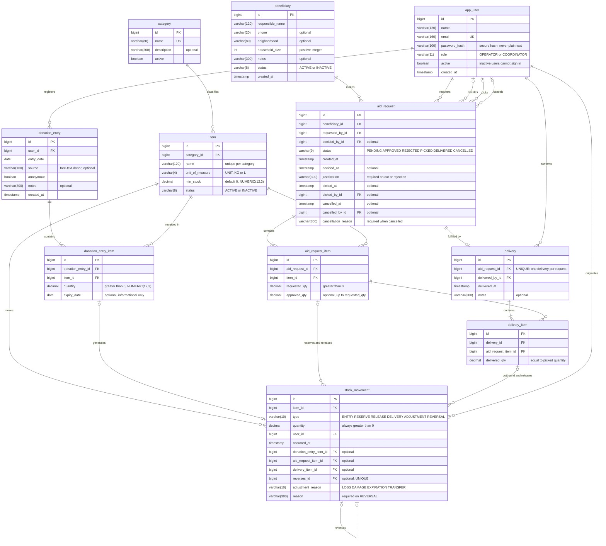

# DER — DoaBem

Versão 3 (06/10/2026): nomes de **tabelas, colunas e valores de enum em inglês**. A interface continua em português. Diagrama em Mermaid (renderiza no GitHub). Referências: `docs/requisitos.md` (RF, RN, Qxx) e `docs/decisoes.md`.

## 1. Diagrama

## 2. Equivalência português ↔ inglês

O PO e a interface usam termos em português; o banco, a API e o código usam inglês. Valores de enum ficam gravados em inglês e a interface os traduz.

### Tabelas

| Português (negócio e tela) | Tabela |
|---|---|
| Usuário | `app_user` (evita a palavra reservada `user`) |
| Categoria | `category` |
| Item / recurso | `item` |
| Entrada de doação | `donation_entry` |
| Item da entrada | `donation_entry_item` |
| Família / beneficiário | `beneficiary` |
| Solicitação | `aid_request` |
| Item da solicitação | `aid_request_item` |
| Entrega | `delivery` |
| Item da entrega | `delivery_item` |
| Movimentação de estoque | `stock_movement` |

### Colunas principais

| Português | Coluna | Português | Coluna |
|---|---|---|---|
| nome | `name` | unidade de medida | `unit_of_measure` |
| senha (hash) | `password_hash` | estoque mínimo | `min_stock` |
| perfil | `role` | situação | `status` |
| ativo | `active` | quantidade | `quantity` |
| data da entrada | `entry_date` | validade | `expiry_date` |
| origem / doador | `source` | doação anônima | `anonymous` |
| observação | `notes` | nome do responsável | `responsible_name` |
| bairro | `neighborhood` | nº de integrantes | `household_size` |
| solicitante | `requested_by_id` | aprovador | `decided_by_id` |
| quantidade solicitada | `requested_qty` | quantidade aprovada | `approved_qty` |
| justificativa | `justification` | motivo do cancelamento | `cancellation_reason` |
| separada em / por | `picked_at` / `picked_by_id` | cancelada em / por | `cancelled_at` / `cancelled_by_id` |
| entregue em / por | `delivered_at` / `delivered_by_id` | quantidade entregue | `delivered_qty` |
| tipo da movimentação | `type` | data/hora | `occurred_at` |
| estorna | `reverses_id` | motivo do ajuste | `adjustment_reason` |
| motivo do estorno | `reason` | criado em | `created_at` |

### Valores de enum

| Campo | Português | Valor gravado |
|---|---|---|
| `app_user.role` | Operador, Coordenador | `OPERATOR`, `COORDINATOR` |
| `item.unit_of_measure` | un., kg, L | `UNIT`, `KG`, `L` |
| `item.status`, `beneficiary.status` | Ativo, Inativo | `ACTIVE`, `INACTIVE` |
| `aid_request.status` | Pendente, Aprovada, Recusada, Separada, Entregue, Cancelada | `PENDING`, `APPROVED`, `REJECTED`, `PICKED`, `DELIVERED`, `CANCELLED` |
| `stock_movement.type` | Entrada, Reserva, Liberação, Saída por entrega, Ajuste, Estorno | `ENTRY`, `RESERVE`, `RELEASE`, `DELIVERY`, `ADJUSTMENT`, `REVERSAL` |
| `stock_movement.adjustment_reason` | Perda, Avaria, Vencimento, Transferência/doação | `LOSS`, `DAMAGE`, `EXPIRATION`, `TRANSFER` |

## 3. Dicionário de dados (resumo)

| Tabela | Papel no domínio | Origem |
|---|---|---|
| `app_user` | Usuário interno com perfil OPERATOR ou COORDINATOR; inativo não autentica | Q18, Q19, Q20 |
| `category` | Agrupa itens (Alimentos, Higiene, Roupas) | Briefing |
| `item` | Recurso doado, com unidade base (UNIT, KG, L), estoque mínimo e status | Q01, Q02, Q04, Q06 |
| `donation_entry` | Cabeçalho do recebimento: data, origem opcional, anônima, responsável | Q14, Q15 |
| `donation_entry_item` | Linha da entrada: item, quantidade e validade informativa | Q03, Q15 |
| `beneficiary` | Família identificada pelo responsável; dados mínimos | Q16, Q17 |
| `aid_request` | Pedido de uma família, com estado, aprovação, separação e cancelamento | Q07 a Q09 |
| `aid_request_item` | Item pedido, com quantidade solicitada e aprovada | Q08 |
| `delivery` | Confirmação da entrega de uma solicitação separada (1:0..1) | Q10, Q12 |
| `delivery_item` | Item entregue, ligado ao item aprovado | Q10 |
| `stock_movement` | Registro imutável que origina todo saldo | RN02, RN03, RN07 |

### Atributos que merecem atenção

| Atributo | Regra |
|---|---|
| `item.unit_of_measure` | UNIT, KG ou L; base do saldo; sem conversão |
| Colunas de quantidade | `NUMERIC(12,3)`; itens em UNIT só aceitam inteiros (validado no service); KG/L até 3 casas |
| `item.min_stock` | Padrão 0 e editável; saldo ≤ mínimo é crítico |
| `donation_entry_item.expiry_date` | Informativa; sem lote, sem alertas e sem saldo por vencimento |
| `beneficiary` | Sem documento, renda, nascimento, endereço completo ou dependentes |
| `aid_request.status` | PENDING, APPROVED, REJECTED, PICKED, DELIVERED, CANCELLED |
| `stock_movement.quantity` | Sempre positiva; o efeito vem do `type` |
| `stock_movement.reverses_id` | Aponta a movimentação original; UNIQUE (estorno único) |

## 4. Relacionamentos e cardinalidades

| Relacionamento | Cardinalidade | Chave estrangeira | Leitura |
|---|---|---|---|
| `category` — `item` | 1 : N | `item.category_id` | Uma categoria classifica vários itens |
| `donation_entry` — `donation_entry_item` | 1 : 1..N | `donation_entry_item.donation_entry_id` | Uma entrada tem ao menos um item |
| `item` — `donation_entry_item` | 1 : N | `donation_entry_item.item_id` | Um item é recebido em várias entradas |
| `beneficiary` — `aid_request` | 1 : N | `aid_request.beneficiary_id` | Uma família faz várias solicitações |
| `aid_request` — `aid_request_item` | 1 : 1..N | `aid_request_item.aid_request_id` | Uma solicitação pede ao menos um item |
| `item` — `aid_request_item` | 1 : N | `aid_request_item.item_id` | Um item aparece em várias solicitações |
| `aid_request` — `delivery` | 1 : 0..1 | `delivery.aid_request_id` (UNIQUE) | Sem entrega parcial (Q10) |
| `delivery` — `delivery_item` | 1 : 1..N | `delivery_item.delivery_id` | Uma entrega tem ao menos um item |
| `aid_request_item` — `delivery_item` | 1 : 0..N | `delivery_item.aid_request_item_id` | Item aprovado e entregue (0..1 efetivo; mais de um só após estorno) |
| `item` — `stock_movement` | 1 : N | `stock_movement.item_id` | Todo item acumula histórico (inclui ADJUSTMENT, sem documento de origem) |
| `donation_entry_item` — `stock_movement` | 1 : 1 | `stock_movement.donation_entry_item_id` | Cada item recebido gera exatamente uma ENTRY |
| `aid_request_item` — `stock_movement` | 1 : 0..N | `stock_movement.aid_request_item_id` | RESERVE na separação e RELEASE no cancelamento |
| `delivery_item` — `stock_movement` | 1 : 1..2 | `stock_movement.delivery_item_id` | DELIVERY e a RELEASE da reserva consumida |
| `stock_movement` — `stock_movement` | 0..1 : 0..1 | `stock_movement.reverses_id` (UNIQUE) | Estornada no máximo uma vez (Q13) |
| `app_user` — `donation_entry` | 1 : N | `donation_entry.user_id` | Responsável pela entrada |
| `app_user` — `aid_request` | 1 : N em 4 papéis | `requested_by_id`, `decided_by_id`, `picked_by_id`, `cancelled_by_id` | Os três últimos são opcionais |
| `app_user` — `delivery` | 1 : N | `delivery.delivered_by_id` | Quem confirmou a entrega (RN05) |
| `app_user` — `stock_movement` | 1 : N | `stock_movement.user_id` | Quem originou a movimentação |

## 5. Como o saldo é obtido (sem coluna de saldo)

| Tipo | Efeito no físico | Efeito no reservado | Quando nasce |
|---|---|---|---|
| `ENTRY` | + quantidade | — | Confirmação da entrada |
| `DELIVERY` | − quantidade | — | Confirmação da entrega |
| `ADJUSTMENT` | − quantidade | — | Saída por ajuste (perda, avaria, vencimento, transferência), só Coordenador |
| `RESERVE` | — | + quantidade | Separação (não na aprovação) |
| `RELEASE` | — | − quantidade | Cancelamento da separação ou consumo da reserva na entrega |
| `REVERSAL` | Inverte o efeito da movimentação apontada por `reverses_id` | | Estorno justificado |

- **Físico** = soma dos efeitos no físico. **Reservado** = soma dos efeitos no reservado. **Disponível** = físico − reservado.
- **Crítico** = saldo ≤ `item.min_stock` (qual saldo comparar: dúvida D-01; proposta: o disponível).
- Aprovar uma solicitação não gera movimentação nem altera saldo (Q09, Q22).
- A lista de movimentações filtra por ENTRY, DELIVERY, ADJUSTMENT e REVERSAL; RESERVE e RELEASE aparecem no detalhe da solicitação (D-08).

## 6. Restrições

### Garantidas no banco

- PK em todas as tabelas; FK com `ON DELETE RESTRICT` (sem exclusão em cascata sobre dados de estoque).
- `UNIQUE`: `app_user.email`, `category.name`, `item(category_id, name)`, `delivery.aid_request_id`, `stock_movement.reverses_id`.
- `CHECK`: quantidades > 0; `approved_qty` ≥ 0 e ≤ `requested_qty`; `household_size` ≥ 1; `min_stock` ≥ 0; domínios de `role`, `status`, `type`, `unit_of_measure` e `adjustment_reason`.
- `CHECK`: `type = 'REVERSAL'` exige `reverses_id` e `reason`; `type = 'ADJUSTMENT'` exige `adjustment_reason`; `status = 'CANCELLED'` exige `cancellation_reason` e `cancelled_at`; `status = 'REJECTED'` exige `justification`.
- **Imutabilidade:** proibir `UPDATE` e `DELETE` em `stock_movement` (trigger ou permissão do usuário da aplicação).
- **Saldo não negativo sob concorrência:** lock da linha do item (`SELECT ... FOR UPDATE`) na mesma transação que confere o disponível e grava RESERVE, DELIVERY ou ADJUSTMENT.

### Garantidas pela aplicação (service)

- Escala da quantidade pela unidade do item: UNIT inteiro; KG e L até 3 casas (Q02).
- Entrada atômica: todas as linhas válidas entram ou nenhuma (Q15).
- Transições de status conforme `docs/requisitos.md` (seção 5); aprovar não reserva, separar reserva de forma atômica e cancelar libera.
- Somente itens `ACTIVE` e famílias `ACTIVE` em novas entradas, solicitações e ajustes; item com reserva ativa não pode ser inativado (Q06).
- A entrega confirma exatamente o que foi separado (sem entrega parcial).
- Estorno: só o Coordenador, com justificativa; estorno de entrada exige saldo disponível suficiente; estorno de entrega devolve ao estoque só se os itens retornaram (Q13, D-02).
- Autorização por perfil no backend (403); usuário inativo não autentica.
