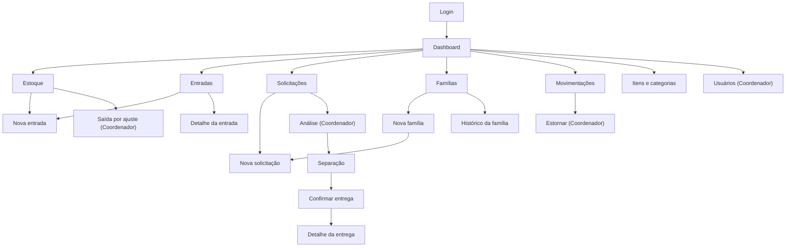
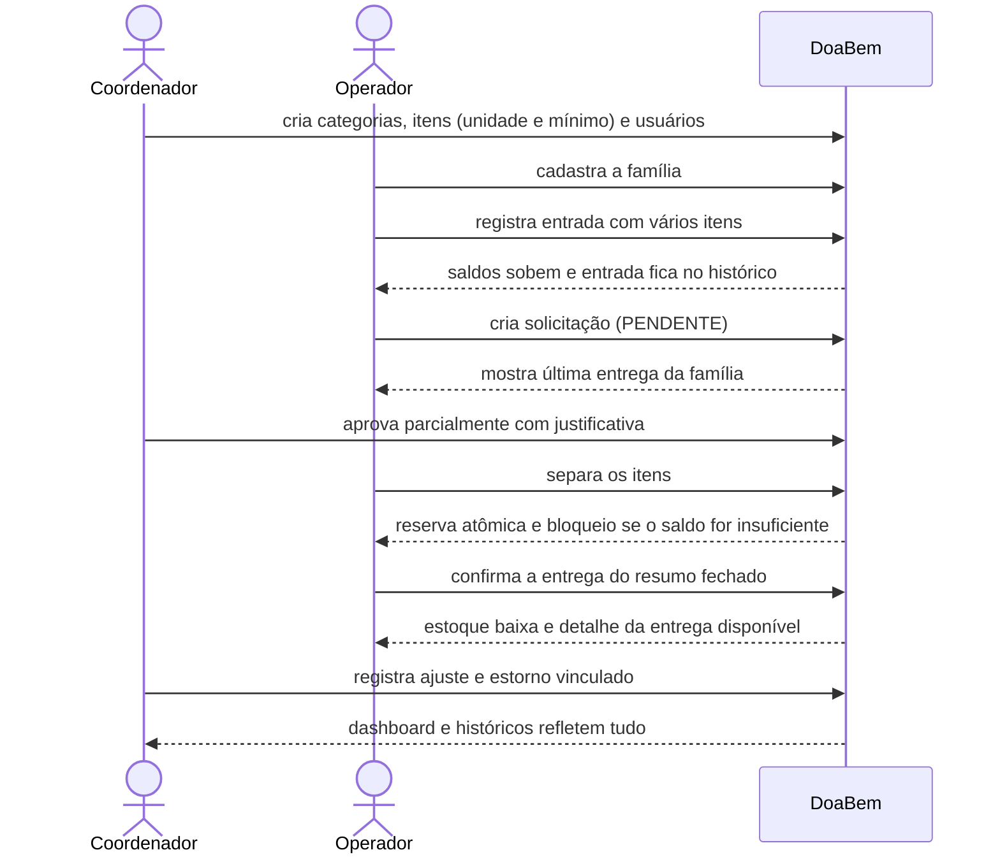

# Fluxo de telas e identidade visual — DoaBem

Atualizado em 06/10/2026 com as telas mínimas definidas pelo PO.

- **Capturas reais do protótipo e guia visual:** [`prototipo.md`](./prototipo.md)
- **Protótipo navegável (dados fictícios):** https://doabem-stock-hub.lovable.app/ — gerado com a versão 1 dos requisitos; precisa receber os ajustes da seção 5 para refletir as respostas do PO.
- **Figma (telas e guia de identidade visual):** https://www.figma.com/design/Epm1g1xvCIwoikzaPzqoTf/Untitled?node-id=0-1
- **Revisão do protótipo contra os requisitos:** [`revisao-prototipo.md`](./revisao-prototipo.md)

## 1. Perfis e telas (9 telas mínimas do PO)

| # | Tela | Operador | Coordenador |
|---|---|---|---|
| 1 | Login e feedback de acesso (credencial inválida, acesso negado) | sim | sim |
| 2 | Dashboard (indicadores atuais e por período) | sim | sim |
| 3 | Categorias e itens (lista, inclusão, edição, inativação, estoque mínimo) | consulta | sim |
| 4 | Nova entrada com múltiplos itens; histórico e detalhe de entradas | sim | sim |
| 5 | Estoque e movimentações com filtros; "Registrar saída por ajuste" e "Estornar" | consulta | sim |
| 6 | Famílias/beneficiários: lista, cadastro e histórico | sim | sim |
| 7 | Solicitações: abertura, lista, análise e decisão | abre e consulta | decide |
| 8 | Separação e confirmação de entrega, com saldo disponível, estados e detalhe da entrega | sim | sim |
| 9 | Usuários internos | não | sim |

## 2. Mapa de navegação

## 3. Fluxo completo demonstrável

## 4. Identidade visual inicial

| Elemento | Definição |
|---|---|
| Nome | DoaBem (logo com caixa e coração; "Bem" em âmbar) |
| Cor primária | Verde-azulado `#1F7A6B`; sidebar `#123F38` |
| Apoio | Âmbar `#E0A030` |
| Neutros | `#1F2937` texto, `#F3F6F5` fundo, `#D7DEDB` bordas |
| Semântica | Vermelho `#C0392B` crítico/erro; verde `#2E9B5F` normal/sucesso; azul `#2F6DB5` saída |
| Tipografia | IBM Plex Sans (conforme o guia de identidade no Figma), títulos em peso 600 a 700 |
| Padrão | Cantos de 6 a 8 px, tabelas densas, um botão primário por tela, gavetas para formulários |
| Estados | Carregamento, vazio, erro e sucesso em toda tela; alerta crítico com texto, não só cor |

## 5. Ajustes necessários no protótipo do Lovable (versão 1 para 2)

- Adicionar a tela de Usuários e o detalhe de entrada/entrega.
- Estados da solicitação: Pendente, Aprovada, Separada, Entregue, Recusada, Cancelada.
- Ação "Registrar saída por ajuste" com motivos predefinidos (Coordenador).
- Entrada: validade opcional (informativa) e "Doação anônima".
- Família: remover documento; incluir bairro e observações; mostrar "Última entrega" e os últimos 30 dias na solicitação e na análise.
- Dashboard: cartões rotulados "saldo atual" ou "no período", filtro de datas (padrão 30 dias) e os cinco itens mais críticos.
- Remover exportação CSV do escopo.
- Rótulo textual "Crítico" além da cor.
