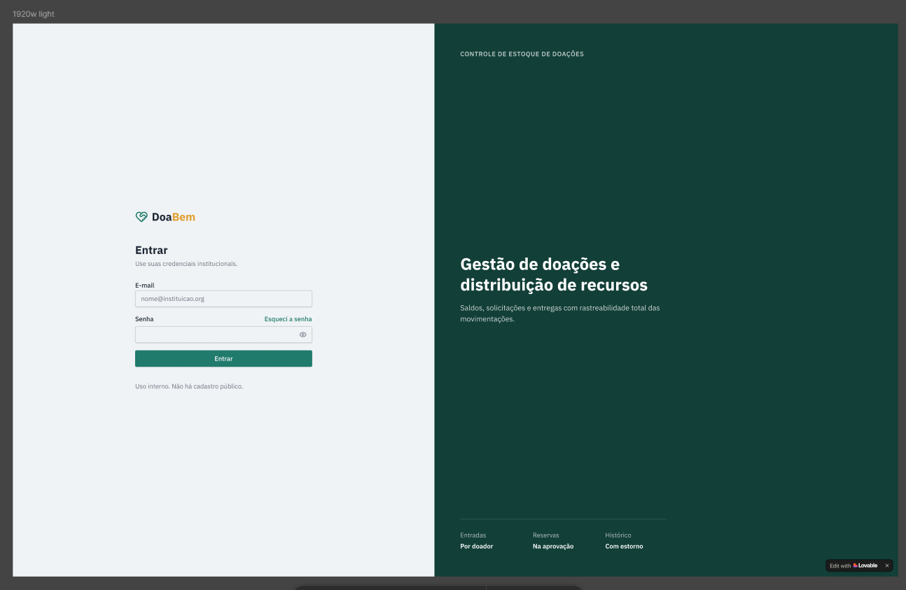
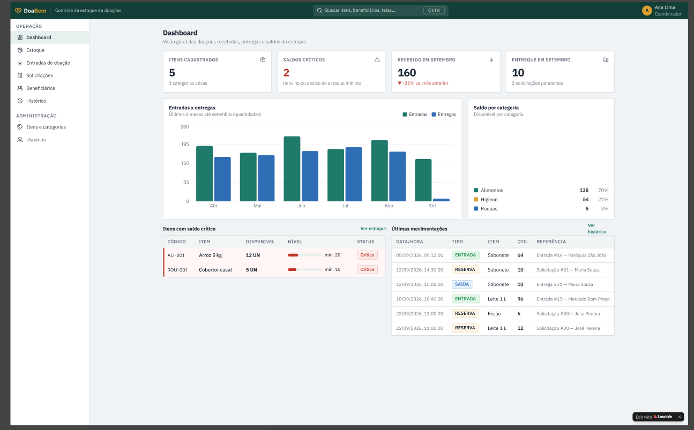
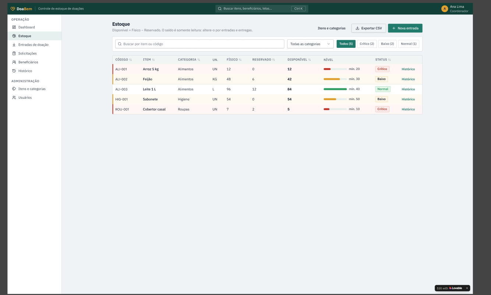
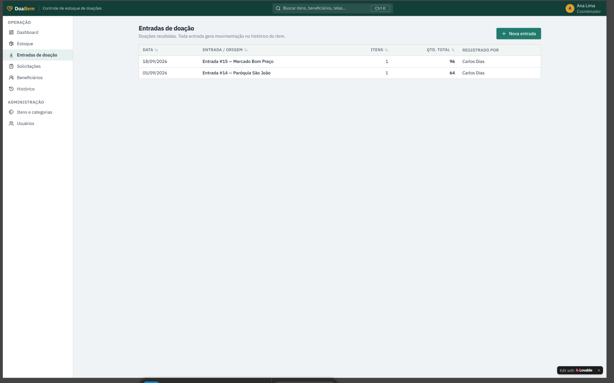
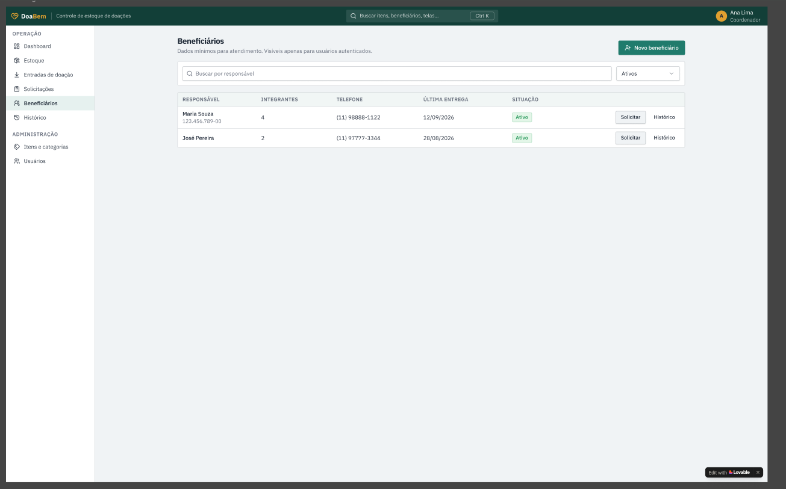
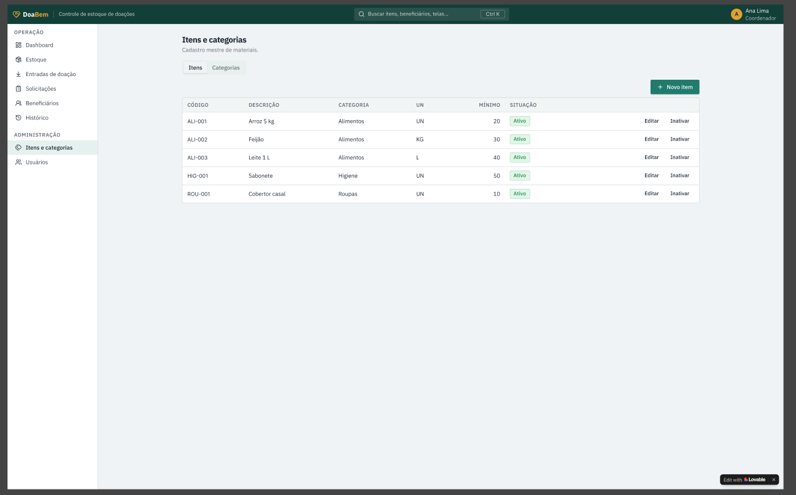
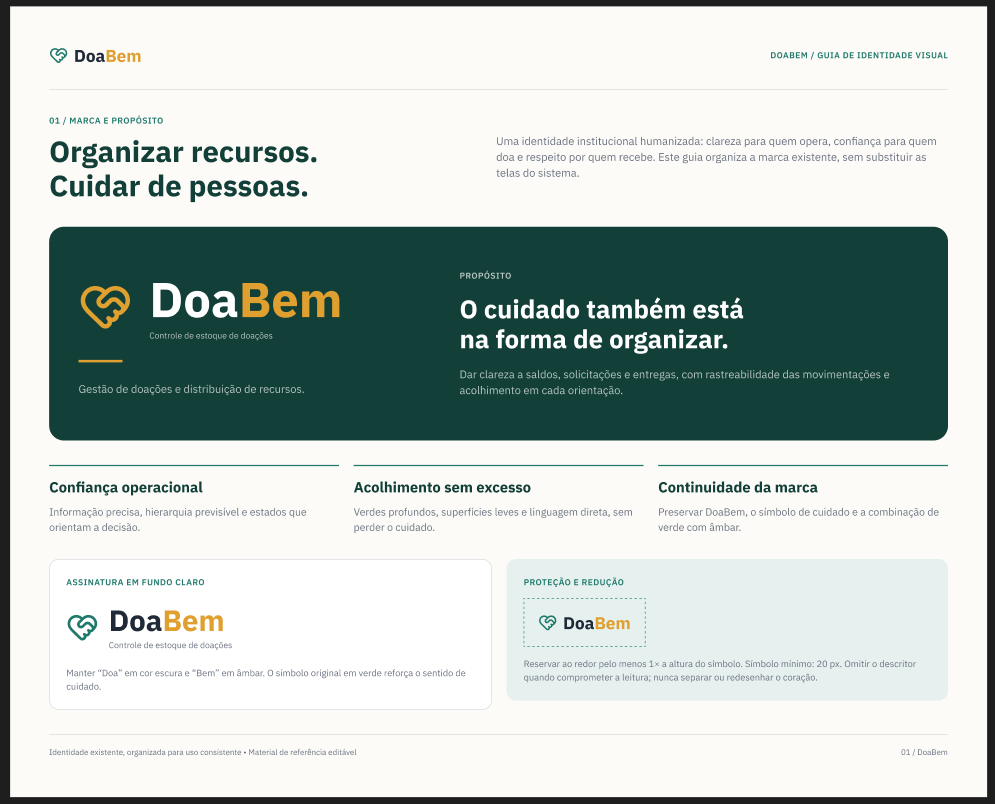
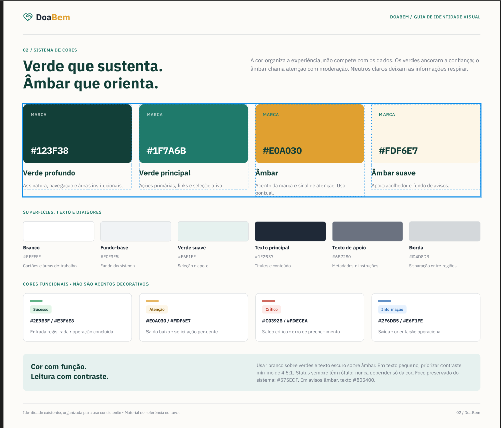
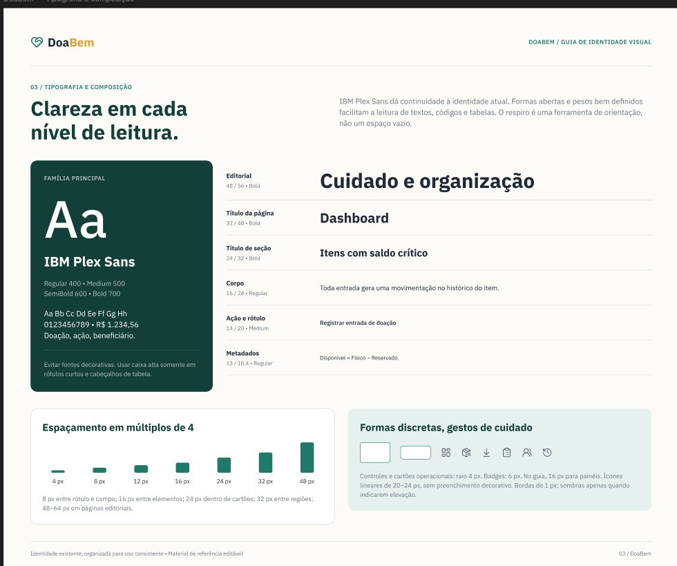
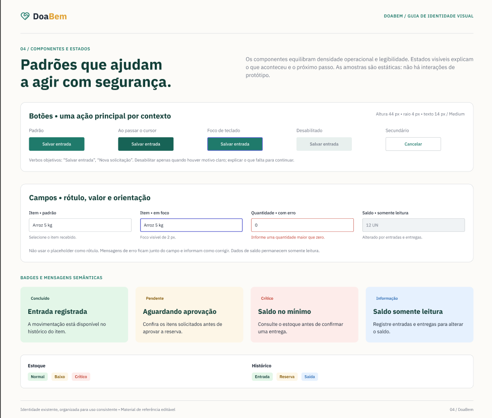

# Protótipo do DoaBem

Capturas da versão atual do protótipo (dados fictícios), do arquivo no Figma. O protótipo foi gerado antes das respostas do PO; os ajustes planejados estão em [`revisao-prototipo.md`](./revisao-prototipo.md).

- Protótipo navegável: https://doabem-stock-hub.lovable.app/
- Figma (telas e guia de identidade visual): https://www.figma.com/design/Epm1g1xvCIwoikzaPzqoTf/Untitled?node-id=0-1
- Fluxo de navegação e identidade visual: [`fluxo-telas.md`](./fluxo-telas.md)

## 1. Telas

### 1.1 Login

Acesso só para uso interno, sem cadastro público.

### 1.2 Dashboard

Indicadores de estoque e entregas, gráfico de entradas e entregas, saldo por categoria, itens com saldo crítico e últimas movimentações.

### 1.3 Estoque

Saldo físico, reservado e disponível por item, com nível e status. O saldo é somente leitura: só muda por entradas e entregas.

### 1.4 Entradas de doação

Lista das doações recebidas; cada entrada gera movimentação no histórico do item.

### 1.5 Solicitações

Pedidos dos beneficiários, com aprovação, separação e entrega.

### 1.6 Beneficiários

Cadastro de famílias com os dados mínimos para atendimento, visível apenas para usuários autenticados.

### 1.7 Itens e categorias

Cadastro mestre de itens, com unidade, estoque mínimo e situação.

## 2. Guia de identidade visual

### 2.1 Marca e propósito

### 2.2 Sistema de cores

### 2.3 Tipografia e composição

### 2.4 Componentes e estados

## 3. Telas ainda por incluir

Nova entrada (formulário), nova solicitação, análise do Coordenador, separação e confirmação de entrega, detalhe da entrega, movimentações com estorno, saída por ajuste, formulário de itens e usuários. Serão capturadas depois que o protótipo receber os ajustes de `revisao-prototipo.md`.
