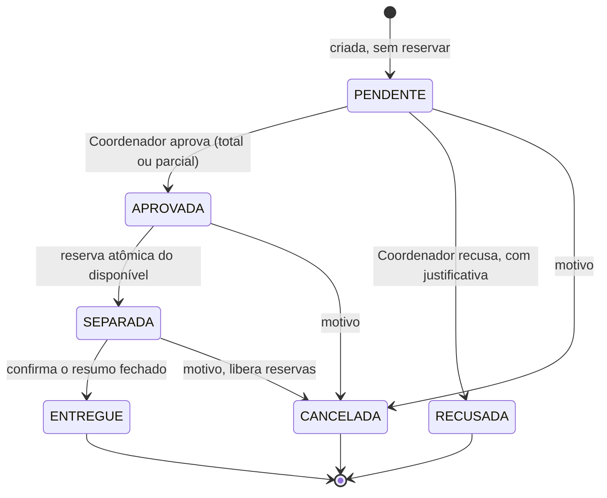

# Documento de Requisitos — DoaBem (MVP)

| | |
|---|---|
| **Projeto** | P05 — Sistema de Gestão de Doações e Distribuição de Recursos |
| **Disciplina** | Engenharia de Software — Fábrica de Software (UNIVILLE) |
| **Cliente / PO** | Prof. William Sestito |
| **Equipe** | João Miguel Zazula Lopes, Gabriel Hardt, Eduardo Angeli, Kaue Dylon Pereira Bruch, Vitor Viebranz Domingos |
| **Versão** | 1.0, consolidada após as respostas do PO de 05/10/2026 |
| **Prazo final** | 05/12/2026 (congelamento de escopo em 16/11/2026) |

> Termos de negócio em português (como o PO e a interface usam). Nomes técnicos de tabelas, colunas e valores de enum são em inglês; a equivalência está em `docs/der/der.md` (seção 2).

Fontes: briefing oficial do projeto, roteiro da Sprint 01 e respostas do PO ao levantamento (22 perguntas). Cada requisito indica a origem (**Qxx** = pergunta respondida).

## 1. Visão do produto

**Problema.** Instituições sociais recebem doações e depois as distribuem a famílias. Com entradas e saídas controladas de forma dispersa, é difícil saber o estoque disponível, a origem dos itens e para quem cada recurso foi destinado.

**Solução.** Sistema web para registrar doações materiais, controlar o estoque por item e organizar a distribuição às famílias de forma rastreável. O saldo é sempre derivado das movimentações e nunca digitado.

**Resultado esperado.** Sistema integrado de ponta a ponta (frontend, API REST e banco relacional) com autenticação por perfil, regras de negócio no backend, testes e documentação.

### 1.1 Escopo do MVP

- Autenticação e perfis internos (Operador e Coordenador); gestão de usuários pelo Coordenador.
- Cadastro de categorias e itens (unidade UN/KG/L, estoque mínimo, situação).
- Entrada de doação com vários itens; estoque e saldo derivado de movimentações; saída por ajuste.
- Cadastro de famílias/beneficiários e histórico.
- Solicitação, análise do Coordenador (total, parcial ou recusa), separação com reserva e entrega com baixa.
- Cancelamento com liberação de reserva; estorno auditável; históricos filtráveis; dashboard.

### 1.2 Fora de escopo neste bimestre

| Item | Origem |
|---|---|
| Doações financeiras; integração com nota fiscal; logística de coleta/rotas; portal público para doadores; integração com sistemas governamentais | Briefing |
| Controle por lote, alertas automáticos de validade e saldo por vencimento (a validade é só informativa) | Q03 |
| Conversão automática entre unidades (caixa, pacote) | Q02 |
| Limite/frequência automática por família e elegibilidade por renda | Q11 |
| Comprovante em PDF, impressão e assinatura eletrônica | Q12 |
| Cadastro de doadores e coleta de CPF/CNPJ | Q14 |
| Cadastro de dependentes; CPF, renda, data de nascimento e endereço completo | Q16, Q17 |
| Recuperação de senha por e-mail; perfil Administrador separado | Q18, Q19 |
| Rascunho de solicitação; expiração automática de aprovação; entrega parcial após a separação | Q09, Q10 |
| Exportação CSV/PDF (opcional; backlog de evolução) | Q21 |

> Funcionalidades fora de escopo só podem ser iniciadas com o MVP funcional, testado e aprovado pelo PO. Melhorias adicionais entram no backlog de evolução e dependem de aprovação.

## 2. Atores e permissões

| Ator | Descrição |
|---|---|
| **Operador** | Usuário interno que registra entradas, cadastra famílias, cria solicitações, separa e entrega. Não aprova nem eleva permissões. |
| **Coordenador** | Executa tudo o que o Operador faz e, em exclusivo, analisa/aprova solicitações, faz ajustes excepcionais, estornos e gerencia usuários. |
| **Família/beneficiário** | Núcleo familiar identificado pelo responsável. Existe só como cadastro; não acessa o sistema. |

### 2.1 Matriz de permissões

| Ação | Operador | Coordenador |
|---|:---:|:---:|
| Login, logout, consultar estoque e históricos | ✔ | ✔ |
| Registrar entrada de doação | ✔ | ✔ |
| Cadastrar/editar famílias e consultar histórico | ✔ | ✔ |
| Criar solicitação | ✔ | ✔ |
| Separar itens e confirmar entrega | ✔ | ✔ |
| Cancelar separação ainda não entregue | ✔ | ✔ |
| Cadastrar categorias e itens; inativar item | ✘ (D-05) | ✔ |
| Aprovar (total/parcial) ou recusar solicitação | ✘ | ✔ |
| Cancelar solicitação pendente/aprovada | ✘ (D-04) | ✔ |
| Registrar saída por ajuste (perda, avaria, vencimento, transferência) | ✘ | ✔ |
| Estornar entrada, entrega ou ajuste | ✘ | ✔ |
| Gerenciar usuários (criar, desativar, atribuir perfil, redefinir senha) | ✘ | ✔ |

As ações restritas não aparecem como disponíveis ao Operador e a API as nega com **403** em tentativa direta (Q20). Itens marcados com D-xx aguardam confirmação do PO.

## 3. Requisitos funcionais

Prioridade (MoSCoW): **Must** obrigatório no MVP · **Should** desejável · **Could** evolução.

### 3.1 Acesso e usuários

| ID | Requisito | Perfil | Prio. | Origem |
|---|---|---|---|---|
| RF01 | Autenticar por e-mail e senha, com mensagem clara para credencial inválida. | Todos | Must | Q19 |
| RF02 | Encerrar a sessão (logout). | Todos | Must | Q19 |
| RF03 | Exibir navegação e ações conforme o perfil; negar com 403 no backend as ações não autorizadas e mostrar estado de acesso negado. | Todos | Must | Q19, Q20 |
| RF04 | Impedir a autenticação de usuários inativos. | Todos | Must | Q18 |
| RF05 | Cadastrar, editar e desativar usuários internos e atribuir perfil (nome, login/e-mail, perfil, status); sem autoatribuição de perfil elevado. | Coord. | Must | Q18 |
| RF06 | Iniciar o sistema com um Coordenador pré-configurado para demonstração, com credenciais de teste documentadas (não reais). | — | Must | Q18 |
| RF07 | Redefinir temporariamente a senha de um usuário por ação controlada, ou documentar o procedimento administrativo equivalente. | Coord. | Should | Q19 |

### 3.2 Categorias e itens

| ID | Requisito | Perfil | Prio. | Origem |
|---|---|---|---|---|
| RF08 | Cadastrar, editar, listar e inativar categorias. | Coord. | Must | Briefing |
| RF09 | Cadastrar item com nome, categoria, unidade de medida base obrigatória (UN, KG ou L), estoque mínimo (padrão 0, editável) e situação. | Coord. | Must | Q01, Q02, Q04 |
| RF10 | Editar item e inativar/reativar com confirmação; bloquear a inativação com reserva ativa e avisar quando houver saldo, exigindo solução operacional antes de concluir. | Coord. | Must | Q06 |
| RF11 | Listar itens com filtro Ativos/Inativos; itens inativos continuam visíveis nas consultas históricas. | Todos | Must | Q06 |

### 3.3 Entradas de doação

| ID | Requisito | Perfil | Prio. | Origem |
|---|---|---|---|---|
| RF12 | Registrar entrada com cabeçalho (data, origem/doador opcional em texto livre, opção "Doação anônima/não informado", observação e responsável automático) e várias linhas de item e quantidade. | Todos | Must | Q14, Q15 |
| RF13 | Permitir, em cada linha, uma validade opcional, identificada como informativa, sem gestão de lotes nem alertas. | Todos | Must | Q03 |
| RF14 | Validar quantidade positiva e coerente com a unidade (UN só inteiros; KG e L até 3 casas decimais); exibir a unidade junto ao campo. | Todos | Must | Q01, Q02 |
| RF15 | Mostrar revisão antes de confirmar; ao confirmar, gravar todas as movimentações de entrada na mesma transação (todas as linhas válidas ou nenhuma). | Todos | Must | Q15 |
| RF16 | Listar entradas e consultar o detalhe de cada uma (itens, quantidades, responsável, data). | Todos | Must | Telas mínimas |

### 3.4 Estoque e movimentações

| ID | Requisito | Perfil | Prio. | Origem |
|---|---|---|---|---|
| RF17 | Exibir por item o saldo físico, reservado e disponível, sempre com a unidade; o saldo é somente leitura e derivado das movimentações. | Todos | Must | Briefing |
| RF18 | Sinalizar item crítico (saldo ≤ estoque mínimo) com rótulo textual "Crítico", sem depender apenas de cor. | Todos | Must | Q04 |
| RF19 | Registrar "saída por ajuste" com motivo predefinido (perda, avaria, vencimento, transferência/doação a outra entidade), quantidade, observação e confirmação; nunca deixar o saldo negativo. | Coord. | Must | Q05 |
| RF20 | Consultar o histórico de movimentações com filtros por período, item e tipo (ENTRADA, SAÍDA POR ENTREGA, AJUSTE, ESTORNO), filtro por usuário (desejável), paginação, estado vazio e detalhe auditável. | Todos | Must | Q22 |
| RF21 | Estornar entrada, entrega ou ajuste com justificativa obrigatória, criando movimentação compensatória vinculada ao original (autor e data/hora); exibir o vínculo entre original e compensação; impedir estorno duplo. | Coord. | Must | Q13, Q22 |

### 3.5 Famílias/beneficiários

| ID | Requisito | Perfil | Prio. | Origem |
|---|---|---|---|---|
| RF22 | Cadastrar família/beneficiário com identificação interna gerada, nome do responsável, telefone (opcional), bairro/localidade (opcional), nº de integrantes (inteiro positivo) e observações objetivas (opcionais). | Todos | Must | Q16, Q17 |
| RF23 | Editar e inativar famílias; apenas famílias ativas recebem novas solicitações. | Todos | Must | Q07 |
| RF24 | Listar e buscar famílias e consultar o histórico (solicitações e entregas com data, estado, itens e responsáveis). | Todos | Must | Q22 |
| RF25 | Exibir "Última entrega" e as entregas recentes (preferencialmente dos últimos 30 dias) ao criar e ao analisar uma solicitação, sem bloquear. | Todos | Must | Q11 |

### 3.6 Solicitações e entregas

| ID | Requisito | Perfil | Prio. | Origem |
|---|---|---|---|---|
| RF26 | Criar solicitação escolhendo uma família ativa e vários itens ativos com quantidades; registra criador e data e fica PENDENTE, sem reservar nem retirar estoque. | Todos | Must | Q07, Q09 |
| RF27 | Listar solicitações com filtro por estado e consultar o detalhe com estado atual e ações disponíveis para o perfil. | Todos | Must | Q09 |
| RF28 | Analisar solicitação: aprovar integralmente, aprovar parcialmente (solicitado × aprovado por item) ou recusar; o aprovado nunca excede o solicitado; justificativa obrigatória em corte ou recusa. | Coord. | Must | Q08 |
| RF29 | Permitir que o Operador consulte o resultado da análise sem poder aprovar. | Operador | Must | Q08 |
| RF30 | Separar itens aprovados: conferir o disponível (já descontadas as reservas ativas) e reservar as quantidades de forma atômica; bloquear com mensagem orientando a revisar a solicitação quando o saldo for insuficiente. APROVADA → SEPARADA. | Todos | Must | Q09 |
| RF31 | Confirmar a entrega da separação completa mostrando um resumo fechado dos itens; consome a reserva, gera as saídas e muda para ENTREGUE, registrando responsável, data/hora e observação opcional. | Todos | Must | Q10, Q12 |
| RF32 | Não permitir entrega parcial nem edição avulsa de quantidades na entrega; em caso de recebimento parcial, cancelar a separação e criar nova solicitação. | Todos | Must | Q10 |
| RF33 | Cancelar solicitação PENDENTE, APROVADA ou SEPARADA (nada entregue) com motivo obrigatório, liberando as reservas existentes. | Todos* | Must | Q09 |
| RF34 | Consultar o detalhe da entrega (família, itens, quantidades, data/hora e usuário) como comprovante digital. | Todos | Must | Q12 |

\* Quem cancela cada estado ainda precisa ser confirmado com o PO (dúvida D-04).

### 3.7 Dashboard

| ID | Requisito | Perfil | Prio. | Origem |
|---|---|---|---|---|
| RF35 | Exibir: total de itens ativos; itens com saldo crítico; entradas no período; entregas concluídas no período; solicitações pendentes; os cinco itens mais críticos com saldo e mínimo. | Todos | Must | Q21 |
| RF36 | Aplicar filtro por datas (padrão: últimos 30 dias) apenas às entradas e entregas; indicadores de estoque e de solicitações pendentes refletem o momento atual. Rotular cada cartão como "saldo atual" ou "no período". | Todos | Must | Q21 |
| RF37 | Exibir estados sem dados nos indicadores e listas. | Todos | Should | Q21 |
| RF38 | Exportar listas e históricos em CSV/PDF. | Todos | Could | Q21 |

## 4. Regras de negócio

| ID | Regra | Origem |
|---|---|---|
| RN01 | O estoque nunca fica negativo. | Briefing |
| RN02 | Toda entrada ou saída gera movimentação rastreável (usuário, data/hora, item, quantidade). | Briefing |
| RN03 | O saldo não é digitado; resulta das movimentações válidas. | Briefing |
| RN04 | A reserva não pode exceder o saldo disponível no momento da separação. | Briefing, Q09 |
| RN05 | A entrega registra responsável, beneficiário, data/hora e itens/quantidades efetivamente entregues. | Briefing, Q12 |
| RN06 | O cancelamento antes da entrega libera a reserva existente. | Briefing, Q09 |
| RN07 | Movimentações concluídas nunca são apagadas; correções por estorno/compensação. | Briefing, Q13 |
| RN08 | Dados de famílias só são acessíveis a perfis internos autorizados. | Briefing, Q16 |
| RN09 | Todo item tem uma unidade base obrigatória (UN, KG ou L); o saldo é calculado nela; não há conversão automática entre unidades. | Q01, Q02 |
| RN10 | Itens em UN aceitam apenas inteiros; KG e L aceitam até 3 casas decimais. Quantidades são sempre positivas. | Q02, Q15 |
| RN11 | Um item é crítico quando o saldo é menor ou igual ao estoque mínimo (mínimo 10 com saldo 10 já é crítico). O mínimo padrão é 0 e é editável. | Q04 |
| RN12 | A validade é opcional e informativa; a interface não sugere rastreabilidade por lote e o saldo não é calculado por vencimento. | Q03 |
| RN13 | Toda redução de estoque exige movimentação auditável, inclusive perda, avaria, vencimento e transferência. Esses ajustes são exclusivos do Coordenador e distintos da entrega. | Q05 |
| RN14 | Item INATIVO não recebe novas entradas, solicitações nem ajustes, mas permanece em consultas históricas; não pode ser inativado com reserva ativa. | Q06 |
| RN15 | Somente famílias ativas e itens ativos podem entrar em novas solicitações. | Q06, Q07 |
| RN16 | Quantidade aprovada ≤ quantidade solicitada; item aprovado com 0 sai da distribuição; corte e recusa exigem justificativa. | Q08 |
| RN17 | A aprovação não reserva itens nem altera saldo; a reserva é feita de forma atômica na separação. Solicitação aprovada não equivale a saída de estoque. | Q09, Q22 |
| RN18 | Estados e transições da solicitação conforme a seção 5. | Q09 |
| RN19 | O cancelamento exige motivo, só vale enquanto nada foi entregue e libera as reservas. | Q09 |
| RN20 | Não há entrega parcial após a separação: a entrega confirma todas as quantidades separadas e reservadas. | Q10 |
| RN21 | Entrega concluída só é corrigida por estorno justificado; nada é apagado. | Q10, Q13 |
| RN22 | Só o Coordenador estorna, com justificativa; o original é imutável; não se estorna duas vezes o mesmo lançamento; estorno de entrada exige saldo disponível suficiente; estorno de entrega devolve ao estoque só quando os itens retornaram à instituição. | Q13 |
| RN23 | A entrada é atômica: todas as linhas válidas entram ou nenhuma. | Q15 |
| RN24 | Origem/doador é opcional, em texto livre, com opção de doação anônima; não se coleta CPF/CNPJ e a informação não é comprovação fiscal. | Q14 |
| RN25 | A família é um núcleo identificado pelo responsável; não se cadastram dependentes nem CPF, renda, nascimento ou endereço completo; evitar observações sobre condições pessoais. | Q16, Q17 |
| RN26 | Entrega recente não bloqueia nova solicitação; serve apenas de apoio à decisão do Coordenador. | Q11 |
| RN27 | O Coordenador executa as ações do Operador além das privativas; o Operador não eleva permissões. | Q20 |
| RN28 | Usuário inativo não autentica; senhas armazenadas com hash seguro; a autorização é validada no backend. | Q18, Q19 |
| RN29 | Indicadores de estoque e de solicitações pendentes refletem o momento atual; apenas entradas e entregas respeitam o filtro de datas (padrão 30 dias). | Q21 |

## 5. Estados da solicitação

| De | Para | Quem | Efeito no estoque | Exigência |
|---|---|---|---|---|
| (criação) | PENDENTE | Operador/Coord. | Nenhum | Família ativa, itens ativos |
| PENDENTE | APROVADA | Coordenador | Nenhum | Justificativa se aprovação parcial |
| PENDENTE | RECUSADA | Coordenador | Nenhum | Justificativa |
| APROVADA | SEPARADA | Operador/Coord. | RESERVA (atômica) | Disponível suficiente |
| SEPARADA | ENTREGUE | Operador/Coord. | Consome reserva; SAÍDA | Confirmação do resumo fechado |
| PENDENTE / APROVADA | CANCELADA | Coordenador (D-04) | Nenhum | Motivo |
| SEPARADA | CANCELADA | Operador/Coord. | Libera as reservas | Motivo; nada entregue |

Estados finais: ENTREGUE, RECUSADA e CANCELADA. A aprovação não expira automaticamente (Q09).

## 6. Cálculo do saldo

- **Físico** = entradas − saídas (entrega e ajuste), considerando os estornos.
- **Reservado** = reservas ativas das solicitações SEPARADAS.
- **Disponível** = físico − reservado. A separação só é aceita se a quantidade ≤ disponível.
- **Crítico** = saldo ≤ estoque mínimo (qual saldo comparar: dúvida D-01; proposta: o disponível).

## 7. Requisitos não funcionais

| ID | Categoria | Requisito |
|---|---|---|
| RNF01 | Usabilidade | Interfaces coerentes e responsivas para desktop/notebook; feedback claro de ações e erros; estados de carregamento, sucesso, vazio e erro; unidade sempre ao lado de quantidade e saldo; alertas não dependem só de cor. |
| RNF02 | Segurança | Senhas com hash seguro; rotas protegidas por perfil; autorização validada no backend (403); dados recebidos sempre validados no backend; sessão ou token à escolha justificada da equipe; logout. |
| RNF03 | Integridade | Regras críticas no serviço e, quando pertinente, por restrições no banco (CHECK, UNIQUE, FK); transações atômicas em entrada, separação, entrega e cancelamento; proteção contra concorrência na baixa de estoque. |
| RNF04 | Rastreabilidade | Data/hora e usuário responsável em movimentações, aprovações, separações, entregas, cancelamentos e estornos. |
| RNF05 | Manutenibilidade | Monólito modular em camadas (Controller → Service → Repository); DTOs; nenhuma regra de negócio relevante em controllers ou no JavaScript de tela. |
| RNF06 | Confiabilidade | Erros previsíveis resultam em resposta adequada da API e mensagem compreensível no frontend. |
| RNF07 | Privacidade | Coleta mínima de dados da família; consulta restrita a perfis autorizados; sem dados sensíveis fora do necessário. |
| RNF08 | Qualidade | Testes JUnit 5 (Mockito quando fizer sentido) cobrindo as regras críticas e os principais fluxos; validação com Jakarta Bean Validation e validações de experiência no frontend. |
| RNF09 | API e documentação | API REST/JSON documentada com OpenAPI/Swagger; README, requisitos, arquitetura, DER e API refletem a versão entregue. |
| RNF10 | Desempenho | Listas paginadas; consultas de saldo e dashboard sem N+1 (view/consulta agregada). |

## 8. Critérios de aceite (Dado / Quando / Então)

**CA01 — Entrada com vários itens (RF12 a RF15)**
- **Dado** um item em KG e um item em UN ativos, **quando** o Operador registra uma entrada com 80,5 kg e 20 un e confirma, **então** são criadas duas movimentações ENTRADA na mesma transação e os saldos físicos sobem.
- **E** se uma linha tiver 2,5 un ou quantidade ≤ 0, **então** nenhuma linha é gravada e o erro é exibido.

**CA02 — Solicitação e aprovação parcial (RF26, RF28)**
- **Dado** uma solicitação PENDENTE com 10 un de Arroz, **quando** o Coordenador aprova 6 un sem justificar, **então** o sistema exige justificativa.
- **Quando** informa a justificativa, **então** o estado vai a APROVADA com 6 un aprovadas e o saldo não muda. Aprovar mais do que o solicitado é rejeitado.

**CA03 — Separação acima do saldo (RF30, RN01, RN04)**
- **Dado** uma solicitação APROVADA de 30 un e disponível de 20 un, **quando** o usuário tenta separar, **então** a separação é bloqueada, nenhuma reserva é criada e a mensagem orienta a revisar a solicitação.

**CA04 — Separação com reserva (RF30)**
- **Dado** disponível 50 un e solicitação APROVADA de 20 un, **quando** o usuário separa, **então** o estado vai a SEPARADA, o reservado sobe 20, o disponível cai para 30 e o físico não muda.

**CA05 — Entrega com baixa (RF31, RN05)**
- **Dado** uma solicitação SEPARADA, **quando** o usuário confirma o resumo fechado, **então** o estado vai a ENTREGUE, a reserva é consumida, o físico baixa a quantidade entregue e a entrega registra família, itens, quantidades, data/hora e usuário. Não há campo para editar quantidades nesta etapa.

**CA06 — Cancelamento com liberação (RF33, RN06)**
- **Dado** uma solicitação SEPARADA, **quando** é cancelada com motivo, **então** o estado vai a CANCELADA, as reservas são liberadas e o disponível volta ao valor anterior. Cancelamento sem motivo ou após a entrega é recusado.

**CA07 — Ajuste e estorno auditáveis (RF19, RF21, RN22)**
- **Dado** o Coordenador logado, **quando** registra uma saída por ajuste "avaria" de 2 un com observação, **então** surge uma movimentação AJUSTE com usuário e data.
- **Quando** estorna uma entrada sem justificativa ou com saldo disponível insuficiente, **então** o sistema recusa.
- **Quando** estorna com justificativa e saldo suficiente, **então** cria movimentação compensatória vinculada ao original; um segundo estorno do mesmo lançamento é impedido.

**CA08 — Controle de acesso (RF03, RF04, RNF02)**
- **Dado** um Operador logado, **quando** tenta aprovar solicitação, ajustar estoque, estornar ou abrir Usuários, inclusive por chamada direta à API, **então** a interface não oferece a ação e a API responde 403. Usuário inativo não consegue autenticar.

**CA09 — Dashboard e históricos consistentes (RF20, RF24, RF35, RF36)**
- **Dado** as operações dos cenários anteriores, **quando** o usuário abre o dashboard com o período padrão de 30 dias, **então** entradas, entregas, itens críticos, pendentes e top 5 críticos batem com o estoque e com o histórico.
- Alterar o período muda só entradas e entregas; os históricos do item e da família mostram as operações com responsáveis.

**CA10 — Inativação de item (RF10, RN14)**
- **Dado** um item com reserva ativa, **quando** o Coordenador tenta inativar, **então** a ação é bloqueada com o motivo visível.
- **Dado** um item inativado, **então** ele não aparece em novas entradas, solicitações e ajustes, mas continua nos históricos.

**CA11 — Item crítico (RF18, RN11)**
- **Dado** um item com mínimo 10 un, **quando** o saldo é 10 un ou 8 un, **então** ele aparece como "Crítico" no estoque e no dashboard, com rótulo textual além da cor.

## 9. Decisões do PO que alteram artefatos já feitos

| Artefato | Mudança necessária |
|---|---|
| DER | SEPARADA e ENTREGUE gravados; entrega 1:1 com a solicitação (sem parcial); tipo AJUSTE com motivo; validade opcional na entrada; doação anônima; beneficiário sem documento e com bairro/observações; item com situação ATIVO/INATIVO; reserva só na separação. Aplicado em `docs/der/der.md`. |
| Protótipo (Lovable) | Acrescentar tela de Usuários; detalhe de entrada; ação "Registrar saída por ajuste"; estados APROVADA/SEPARADA/ENTREGUE; campo validade informativa e "Doação anônima"; remover documento do beneficiário; mostrar "Última entrega" e entregas dos últimos 30 dias; estorno com vínculo; filtro de datas no dashboard com cartões "atual" ou "no período"; remover exportação CSV do escopo. |
| Fluxo de telas | Inclui Usuários e detalhe da entrega/entrada (nove telas mínimas do PO). Aplicado em `docs/mockups/`. |

## 10. Dúvidas remanescentes para o PO

| ID | Pergunta | Proposta da equipe |
|---|---|---|
| D-01 | O "saldo" comparado ao estoque mínimo é o físico ou o disponível (físico − reservado)? | Disponível, pois é o que pode ser distribuído. |
| D-02 | No estorno de uma entrega, se os itens não retornaram, qual é o tratamento justificado (sem criar estoque fictício)? | Não gerar movimentação de estoque e orientar o uso de ajuste, mantendo o motivo. |
| D-03 | Entradas e ajustes podem ser estornados? E um estorno pode ser estornado? | Entradas, entregas e ajustes sim; estorno de estorno não. |
| D-04 | Quem cancela cada estado? O Operador pode cancelar uma PENDENTE criada por ele? | Coordenador cancela PENDENTE/APROVADA; Operador e Coordenador cancelam SEPARADA. |
| D-05 | O Operador pode cadastrar categorias e itens? | Somente o Coordenador cadastra e edita; Operador consulta. |
| D-06 | Aprovação parcial com todas as quantidades iguais a zero equivale a recusa? | Sim, tratada como recusa com justificativa. |
| D-07 | Inativar item com saldo positivo: bloqueia ou só avisa? Qual "solução operacional"? | Avisar e bloquear até o saldo disponível ser zerado por ajuste ou entrega. |
| D-08 | Reservas e liberações aparecem no histórico do usuário ou só na auditoria? | Só os quatro tipos do PO na lista; reservas no detalhe da solicitação. |
| D-09 | Quando a família pode ser inativada e o que acontece com solicitações em andamento? | Inativação bloqueada com solicitação PENDENTE, APROVADA ou SEPARADA. |
| D-10 | "Cestas prontas" são um item comum em UN (sem composição)? | Sim, item comum, sem composição. |
| D-11 | A redefinição de senha é ação do sistema ou procedimento administrativo documentado? | Ação do Coordenador gerando senha temporária com troca obrigatória, se houver tempo; senão, procedimento documentado. |

> Decisões técnicas (banco, build, frontend, sessão ou token) permanecem com o grupo e são registradas em `docs/arquitetura.md` e `docs/decisoes.md`.
